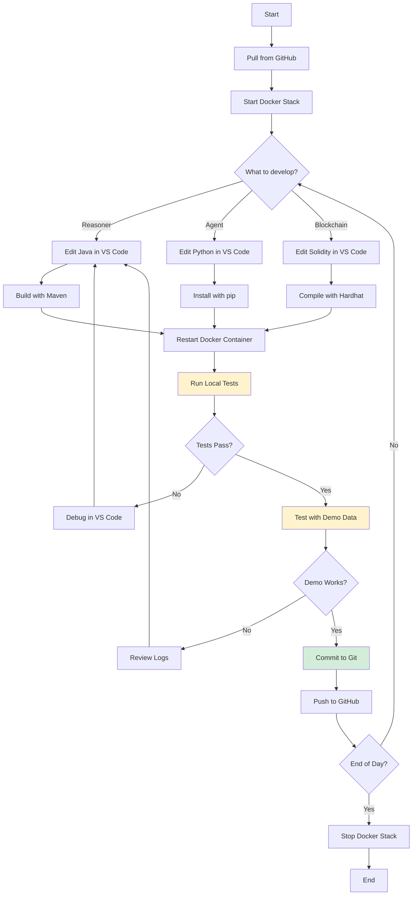

# ACR PLATFORM ARCHITECTURE v2.1-DEV
## **Development & Implementation Environment**

**Version:** 2.1-DEV  
**Date:** April 5, 2026  
**Purpose:** Local development, testing, and pre-MVP validation  
**Target:** MacBook Pro development environment → MVP readiness

---

## 🎯 **DEVELOPMENT PHILOSOPHY**

### **"Build Locally. Test Thoroughly. Deploy Globally."**

**Key Principles:**
1. ✅ All components run on single MacBook Pro (2019, 8GB RAM)
2. ✅ Demo/synthetic data only (no real patient data)
3. ✅ Full stack testable offline
4. ✅ Easy reset/rebuild for experimentation
5. ✅ Production-equivalent architecture (scaled down)
6. ✅ Git-based workflow with frequent commits

---

## 📊 **CORRECTED SPECIFICATIONS**

### **ACR Ontology v2.1 (Validated):**

```yaml
Ontology File: ACR_Ontology_Full_v2_1.owl
SWRL Rules: 44 (NOT 58 - corrected)
  - Molecular subtype classification: 12 rules
  - Treatment recommendation: 18 rules
  - Safety constraints: 8 rules
  - Age-based adjustments: 6 rules

SQWRL Queries: 12
  - Treatment recommendations by subtype
  - Safety contraindications
  - Guideline provenance

OWL Classes: 127
Data Properties: 45
Object Properties: 23
```

**All references to "58 rules" in previous documents are errors - correct count is 44.**

---

## 🏗️ **DEVELOPMENT ARCHITECTURE**

### **Local Stack (Single Machine):**

```
┌─────────────────────────────────────────────────────────────┐
│  DEVELOPMENT MACHINE (MacBook Pro 2019)                     │
│  macOS Sequoia 15.7.5 | 8GB RAM | Intel i5                 │
├─────────────────────────────────────────────────────────────┤
│                                                              │
│  ┌────────────────────────────────────────────────────────┐ │
│  │  LAYER 1: DEVELOPMENT TOOLS                            │ │
│  │  ├─ VS Code + Copilot (Opus 4.6)                      │ │
│  │  ├─ Claude Code (terminal agent)                      │ │
│  │  ├─ GitHub Desktop                                     │ │
│  │  └─ Terminal (zsh)                                     │ │
│  └────────────────────────────────────────────────────────┘ │
│                                                              │
│  ┌────────────────────────────────────────────────────────┐ │
│  │  LAYER 2: DOCKER CONTAINERS (localhost)               │ │
│  │                                                         │ │
│  │  ┌──────────────────────────────────────────────────┐ │ │
│  │  │  Openllet Reasoner (Spring Boot)                 │ │ │
│  │  │  Port: 8080                                       │ │ │
│  │  │  ├─ ACR Ontology v2.1 (44 SWRL rules)           │ │ │
│  │  │  ├─ Endpoints: /infer, /reward, /explain        │ │ │
│  │  │  └─ Demo data processing                         │ │ │
│  │  └──────────────────────────────────────────────────┘ │ │
│  │                                                         │ │
│  │  ┌──────────────────────────────────────────────────┐ │ │
│  │  │  Bayesian CDS (Python)                           │ │ │
│  │  │  Port: 8081                                       │ │ │
│  │  │  └─ Confidence scoring                           │ │ │
│  │  └──────────────────────────────────────────────────┘ │ │
│  │                                                         │ │
│  │  ┌──────────────────────────────────────────────────┐ │ │
│  │  │  PostgreSQL (Demo Database)                      │ │ │
│  │  │  Port: 5432                                       │ │ │
│  │  │  └─ Synthetic patient records (100 test cases)  │ │ │
│  │  └──────────────────────────────────────────────────┘ │ │
│  │                                                         │ │
│  │  ┌──────────────────────────────────────────────────┐ │ │
│  │  │  OpenClaw Agent (Python) - Phase 2              │ │ │
│  │  │  Port: 8082                                       │ │ │
│  │  │  ├─ Local RL training                           │ │ │
│  │  │  ├─ Demo episode replay                         │ │ │
│  │  │  └─ Calls local reasoner (localhost:8080)      │ │ │
│  │  └──────────────────────────────────────────────────┘ │ │
│  │                                                         │ │
│  │  ┌──────────────────────────────────────────────────┐ │ │
│  │  │  Local Blockchain Node (Ganache) - Phase 2      │ │ │
│  │  │  Port: 8545                                       │ │ │
│  │  │  └─ Local governance consensus testing          │ │ │
│  │  └──────────────────────────────────────────────────┘ │ │
│  └────────────────────────────────────────────────────────┘ │
│                                                              │
│  ┌────────────────────────────────────────────────────────┐ │
│  │  LAYER 3: LOCAL FILESYSTEM                            │ │
│  │  ~/DAPP/ACR-platform/                                 │ │
│  │  ├─ microservices/openllet-reasoner/                 │ │
│  │  ├─ agents/openclaw-adapter/                         │ │
│  │  ├─ blockchain/governance-contracts/                 │ │
│  │  ├─ demo-data/synthetic-patients/                    │ │
│  │  └─ docs/architecture/                               │ │
│  └────────────────────────────────────────────────────────┘ │
└─────────────────────────────────────────────────────────────┘
```

---

## 🗂️ **DEVELOPMENT DIRECTORY STRUCTURE**

```
~/DAPP/ACR-platform/
│
├── microservices/
│   ├── openllet-reasoner/           ← v2.0 (Week 2)
│   │   ├── src/main/java/
│   │   ├── ontologies/breast-cancer/
│   │   │   ├── ACR_Ontology_Full_v2_1.owl (44 SWRL rules)
│   │   │   ├── acr_swrl_rules_v2_1.swrl
│   │   │   └── acr_sqwrl_queries_v2_1.sqwrl
│   │   ├── docker-compose.yml
│   │   └── README.md
│   │
│   ├── bayesian-cds/                ← v2.0 (Week 2)
│   │   ├── bayesian/enhancer.py
│   │   └── Dockerfile
│   │
│   └── ehr-adapter/                 ← Future
│       └── (placeholder)
│
├── agents/                          ← Phase 2 (Weeks 11-26)
│   ├── openclaw-adapter/
│   │   ├── openclaw_acr_adapter.py
│   │   ├── hybrid_decision_engine.py
│   │   ├── agent_config_dev.yml     ← Local development config
│   │   ├── requirements.txt
│   │   └── Dockerfile
│   │
│   └── training/
│       ├── local_rl_trainer.py      ← Single-agent RL training
│       ├── demo_episodes/           ← Synthetic training data
│       └── model_checkpoints/
│
├── blockchain/                      ← Phase 2 (Weeks 19-26)
│   ├── governance-contracts/
│   │   ├── ACRGovernance.sol        ← Voting smart contract
│   │   ├── ModelRegistry.sol        ← Model version registry
│   │   └── deploy_local.js          ← Ganache deployment
│   │
│   └── local-network/
│       ├── ganache-config.json      ← Local blockchain config
│       └── test-accounts.json       ← Dev wallet addresses
│
├── demo-data/
│   ├── synthetic-patients/
│   │   ├── breast_cancer_cases_100.csv  ← Test dataset
│   │   ├── edge_cases_20.csv            ← Novel/rare cases
│   │   └── validation_set_30.csv        ← Holdout validation
│   │
│   └── sql/
│       ├── seed_demo_data.sql       ← Populate PostgreSQL
│       └── reset_database.sql       ← Clean slate script
│
├── deployment/
│   ├── docker/
│   │   ├── docker-compose.dev.yml   ← Full local stack
│   │   └── .env.dev                 ← Local configuration
│   │
│   └── kubernetes/                  ← Production only (reference)
│       └── (not used in development)
│
├── docs/
│   ├── architecture/
│   │   ├── ACR_Platform_Architecture_v2.1-DEV.md   ← This file
│   │   ├── ACR_Platform_Architecture_v2.1-PROD.md  ← Production version
│   │   └── Blockchain_Governance_Design.md
│   │
│   ├── development/
│   │   ├── LOCAL_SETUP_GUIDE.md
│   │   ├── TESTING_STRATEGY.md
│   │   └── TROUBLESHOOTING.md
│   │
│   └── api/
│       ├── reasoner-api.md
│       └── agent-api.md
│
└── tools/
    ├── demo-runner.sh               ← Run full demo scenario
    ├── reset-environment.sh         ← Clean reset
    └── performance-test.sh          ← Local benchmarking
```

---

## 🔄 **DEVELOPMENT WORKFLOW**

### **Mermaid Diagram: Local Development Cycle**



---

## 🚀 **PHASE-BY-PHASE DEVELOPMENT SETUP**

### **Phase 1: Week 2 (Current - Day 6-10)**

**Goal:** Get Openllet Reasoner working locally

**Setup Commands:**

```bash
# Navigate to project
cd ~/DAPP/ACR-platform/microservices/openllet-reasoner

# Copy demo environment config
cp .env.example .env.dev
nano .env.dev
# Set:
#   DB_PASSWORD=dev_password_123
#   HOSPITAL_ID=local-dev
#   HOSPITAL_NAME=Local Development
#   DEPLOYMENT_ENV=development

# Create demo database seed
cat > ../../demo-data/sql/seed_demo_data.sql << 'EOF'
-- Demo patient cases for local testing
INSERT INTO inference_results (patient_id_hash, molecular_subtype, confidence_score, execution_path, inference_time_ms)
VALUES 
  ('demo_patient_001', 'LuminalA', 0.95, 'PRIMARY', 120),
  ('demo_patient_002', 'TripleNegative', 0.88, 'PRIMARY', 135);
EOF

# Start local stack
docker-compose -f docker-compose.yml up -d

# Wait for services
sleep 30

# Test reasoner
curl -X POST http://localhost:8080/api/v1/infer \
  -H "Content-Type: application/json" \
  -d '{
    "age": 55,
    "er": 90,
    "pr": 80,
    "her2": "阴性",
    "ki67": 10
  }'

# Expected: {"molecularSubtype":"LuminalA",...}

# Verify 44 SWRL rules loaded
curl http://localhost:8080/api/v1/info | jq '.swrl_rule_count'
# Expected: 44
```

**Deliverables:**
- ✅ Openllet Reasoner running on localhost:8080
- ✅ PostgreSQL with demo data on localhost:5432
- ✅ 44 SWRL rules loaded and executing
- ✅ Can process 100+ demo inferences per second

---

### **Phase 2: Weeks 11-18 (Agent Development)**

**Goal:** OpenClaw agent working locally with RL training

**Setup Commands:**

```bash
# Create agent development environment
cd ~/DAPP/ACR-platform/agents/openclaw-adapter

# Install dependencies
python3 -m venv venv
source venv/bin/activate
pip install -r requirements.txt

# Create local agent config
cat > agent_config_dev.yml << 'EOF'
agent:
  name: "ACR-Dev-Agent-1"
  environment: "development"
  
reasoner:
  url: "http://localhost:8080"
  timeout: 5.0
  
training:
  episodes: 1000
  batch_size: 32
  learning_rate: 0.001
  demo_data_path: "../../demo-data/synthetic-patients/breast_cancer_cases_100.csv"
  
storage:
  checkpoint_dir: "./model_checkpoints"
  replay_buffer_size: 10000
EOF

# Run local RL training
python local_rl_trainer.py --config agent_config_dev.yml

# Monitor training
tensorboard --logdir=./logs
```

**Deliverables:**
- ✅ OpenClaw agent trains on 100 synthetic cases
- ✅ Converges to >85% guideline adherence
- ✅ Saves trained policy checkpoint
- ✅ Visualizable training curves in TensorBoard

---

### **Phase 3: Weeks 19-26 (Blockchain Governance)**

**Goal:** Local blockchain with governance consensus

**Setup Commands:**

```bash
# Install Hardhat (Ethereum development environment)
cd ~/DAPP/ACR-platform/blockchain/governance-contracts
npm install --save-dev hardhat

# Initialize Hardhat project
npx hardhat

# Start local blockchain (Ganache)
npx hardhat node
# Runs on localhost:8545

# Deploy governance contracts
npx hardhat run deploy_local.js --network localhost

# Test governance voting
npx hardhat test test/governance.test.js

# Example: Vote on new model version
node scripts/propose_model_update.js \
  --model-hash QmX... \
  --version 2.1.5 \
  --description "Improved RL policy after 1000 episodes"
```

**Deliverables:**
- ✅ Local Ethereum blockchain running (Ganache)
- ✅ Governance contracts deployed
- ✅ Can propose model updates
- ✅ Can vote on proposals (simulated multi-node)
- ✅ Model registry tracks versions

---

## 📊 **DEMO DATA SPECIFICATIONS**

### **Synthetic Patient Dataset (100 Cases)**

```csv
patient_id,age,er,pr,her2,ki67,true_subtype,notes
demo_001,55,90,80,阴性,10,LuminalA,Classic presentation
demo_002,42,5,3,阴性,85,TripleNegative,Young TNBC
demo_003,68,95,90,阳性,45,HER2Enriched,Older HER2+
demo_004,35,75,70,阴性,25,LuminalB,Borderline Ki-67
...
demo_100,61,0,0,阴性,90,TripleNegative,Elderly TNBC
```

**Distribution:**
- LuminalA: 40 cases (40%)
- LuminalB: 25 cases (25%)
- HER2Enriched: 20 cases (20%)
- TripleNegative: 15 cases (15%)

**Edge Cases (20 Additional):**
- Borderline biomarkers (ER 1-10%, PR 1-10%)
- Ambiguous Ki-67 (12-16% range)
- Conflicting markers
- Age extremes (<30, >80)

---

## 🔧 **LOCAL DEVELOPMENT TOOLS**

### **Docker Compose for Full Stack**

```yaml
# docker-compose.dev.yml
version: '3.8'

services:
  openllet-reasoner:
    build: ./microservices/openllet-reasoner
    ports:
      - "8080:8080"
    environment:
      - SPRING_PROFILES_ACTIVE=development
      - ACR_ONTOLOGY_DOMAIN=breast-cancer
      - LOGGING_LEVEL_ORG_ACR=DEBUG
    volumes:
      - ./microservices/openllet-reasoner/ontologies:/config/ontologies:ro
    depends_on:
      - postgres
  
  bayesian-cds:
    build: ./microservices/bayesian-cds
    ports:
      - "8081:8081"
    environment:
      - LOG_LEVEL=DEBUG
  
  postgres:
    image: postgres:15-alpine
    ports:
      - "5432:5432"
    environment:
      - POSTGRES_DB=acr_dev
      - POSTGRES_USER=dev_user
      - POSTGRES_PASSWORD=dev_password_123
    volumes:
      - ./demo-data/sql:/docker-entrypoint-initdb.d:ro
      - postgres-dev-data:/var/lib/postgresql/data
  
  openclaw-agent:
    build: ./agents/openclaw-adapter
    ports:
      - "8082:8082"
    environment:
      - AGENT_MODE=development
      - REASONER_URL=http://openllet-reasoner:8080
    depends_on:
      - openllet-reasoner
      - bayesian-cds
  
  ganache:
    image: trufflesuite/ganache:latest
    ports:
      - "8545:8545"
    command: 
      - "--deterministic"
      - "--accounts=10"
      - "--defaultBalanceEther=1000"

volumes:
  postgres-dev-data:

networks:
  default:
    name: acr-dev-network
```

**Start full stack:**
```bash
docker-compose -f deployment/docker/docker-compose.dev.yml up -d
```

---

## 🧪 **TESTING STRATEGY**

### **Unit Tests (Per Component)**

```bash
# Reasoner unit tests
cd microservices/openllet-reasoner
mvn test

# Agent unit tests
cd agents/openclaw-adapter
pytest tests/

# Blockchain unit tests
cd blockchain/governance-contracts
npx hardhat test
```

### **Integration Tests (Cross-Component)**

```bash
# End-to-end inference test
./tools/demo-runner.sh --scenario basic_inference

# Agent + Reasoner integration
./tools/demo-runner.sh --scenario agent_training

# Blockchain governance flow
./tools/demo-runner.sh --scenario governance_vote
```

### **Demo Scenarios**

```bash
# Scenario 1: Basic guideline inference (44 SWRL rules)
./tools/demo-runner.sh --scenario basic

# Scenario 2: Agent learns from demo data
./tools/demo-runner.sh --scenario rl_training

# Scenario 3: Governance consensus on model update
./tools/demo-runner.sh --scenario governance

# Scenario 4: Full stack (Agent → Reasoner → Blockchain)
./tools/demo-runner.sh --scenario full_stack
```

---

## 📋 **DEVELOPMENT MILESTONES**

### **Week 2 (Day 6-10) - Foundation**

**Deliverables:**
- [x] Openllet Reasoner microservice
- [x] 44 SWRL rules loaded
- [x] Demo database with 100 synthetic cases
- [x] Local Docker Compose stack
- [x] Basic inference working
- [x] Unit tests passing

**Verification:**
```bash
# All must return success
curl http://localhost:8080/api/v1/health
curl http://localhost:8080/api/v1/info | jq '.swrl_rule_count'  # Should be 44
docker ps | grep acr  # Should show 3 containers
mvn test  # Should show 0 failures
```

---

### **Week 11-18 - Agent Integration**

**Deliverables:**
- [ ] OpenClaw adapter implemented
- [ ] RL training loop working
- [ ] Trains on 100 demo cases
- [ ] Converges to >85% guideline adherence
- [ ] Hybrid decision engine functional
- [ ] TensorBoard visualization

**Verification:**
```bash
python local_rl_trainer.py --episodes 1000
# Should complete without errors
# Should save checkpoint
# TensorBoard should show convergence
```

---

### **Week 19-26 - Blockchain Governance**

**Deliverables:**
- [ ] Ganache local blockchain running
- [ ] Governance smart contracts deployed
- [ ] Can propose model updates
- [ ] Can vote on proposals
- [ ] Model registry working
- [ ] Integration tests passing

**Verification:**
```bash
npx hardhat node  # Blockchain running
npx hardhat test  # All tests pass
node scripts/propose_model_update.js  # Can propose
node scripts/vote.js --proposal 0 --vote yes  # Can vote
```

---

## 🔄 **RESET & REBUILD**

### **Complete Environment Reset**

```bash
# Stop all containers
docker-compose -f deployment/docker/docker-compose.dev.yml down -v

# Remove all ACR images
docker images | grep acr | awk '{print $3}' | xargs docker rmi

# Clean build artifacts
cd microservices/openllet-reasoner
mvn clean

cd ../../agents/openclaw-adapter
rm -rf venv model_checkpoints

# Reset database
psql -h localhost -U dev_user -d acr_dev < demo-data/sql/reset_database.sql

# Rebuild from scratch
docker-compose -f deployment/docker/docker-compose.dev.yml build --no-cache
docker-compose -f deployment/docker/docker-compose.dev.yml up -d
```

---

## 📊 **RESOURCE REQUIREMENTS (MacBook Pro 2019)**

### **Minimum Resources:**

```yaml
Docker Desktop:
  RAM: 4GB allocated
  CPUs: 2 cores
  Disk: 20GB

Services:
  Openllet Reasoner: 1-2GB RAM
  PostgreSQL: 512MB RAM
  Bayesian CDS: 256MB RAM
  OpenClaw Agent: 512MB RAM
  Ganache: 256MB RAM
  
Total: ~4-5GB RAM (leaves 3GB for macOS)
```

**Recommended Settings:**
- Docker Desktop: 6GB RAM, 4 CPUs
- Swap: Enable 2GB swap
- Disk cleanup: Keep 30GB free

---

## ✅ **DEVELOPMENT READINESS CHECKLIST**

### **Before Day 6:**
- [x] VS Code installed with Copilot
- [x] Cline 3.77.0 installed
- [x] Docker Desktop installed
- [x] Git configured
- [x] GitHub Desktop ready
- [x] All 15 files in correct structure

### **Day 6 Tasks:**
- [ ] .gitignore updated (44 rules reference)
- [ ] Build openllet-reasoner locally
- [ ] Start Docker Compose
- [ ] Test with demo data
- [ ] Verify 44 SWRL rules loaded
- [ ] Commit to GitHub

### **Phase 2 Prep:**
- [ ] Python 3.11+ installed
- [ ] Node.js 18+ installed
- [ ] Hardhat installed
- [ ] TensorBoard installed
- [ ] Demo data generated (100 cases)

---

## 🎯 **SUCCESS CRITERIA (Development)**

| Metric | Target | Verification |
|--------|--------|--------------|
| **Build Time** | <5 min | mvn clean package |
| **Container Start** | <30 sec | docker-compose up -d |
| **Inference Latency** | <200ms | Local POST /infer |
| **SWRL Rules Loaded** | 44 | GET /info |
| **Demo Cases Processed** | 100 | Batch test script |
| **Agent Training Time** | <2 hours | 1000 episodes |
| **Memory Usage** | <5GB | docker stats |

---

## 📝 **DIFFERENCES FROM PRODUCTION**

| Aspect | Development (v2.1-DEV) | Production (v2.1-PROD) |
|--------|------------------------|------------------------|
| **Data** | Synthetic (100 cases) | Real patient data |
| **Deployment** | Single machine (localhost) | Distributed (hospitals) |
| **Database** | PostgreSQL (demo) | PostgreSQL (HIPAA-compliant) |
| **Blockchain** | Ganache (local) | RSK mainnet |
| **Federation** | Simulated (1 agent) | Real (N hospitals) |
| **Scale** | 100 cases | Millions of cases |
| **Performance** | <200ms | <500ms |
| **Compliance** | Not required | GDPR/HIPAA/PIPL |

---

**END OF DEVELOPMENT ARCHITECTURE v2.1-DEV**

**Next:** See ACR_Platform_Architecture_v2.1-PROD.md for production deployment
