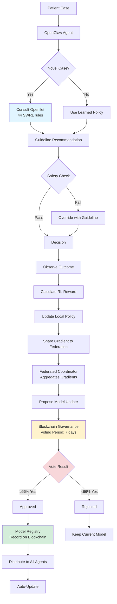

# ACR PLATFORM v2.1 - CORRECTIONS & CLARIFICATIONS

**Date:** April 5, 2026  
**Purpose:** Address critical feedback and architectural gaps

---

## 🔧 **CRITICAL CORRECTIONS**

### **1. SWRL Rule Count: 44 (NOT 58) ✅**

**Error Found:**
- ❌ Previous documents stated "58 SWRL rules"
- ✅ Correct count: **44 SWRL rules** (from validated ACR_Ontology_Full_v2_1.owl)

**Distribution of 44 Rules:**
```yaml
Molecular Subtype Classification: 12 rules
├─ LuminalA identification: 3 rules
├─ LuminalB identification: 3 rules
├─ HER2Enriched identification: 3 rules
└─ TripleNegative identification: 3 rules

Treatment Recommendation: 18 rules
├─ Endocrine therapy rules: 6 rules
├─ HER2-targeted therapy rules: 5 rules
├─ Chemotherapy rules: 5 rules
└─ Combination therapy rules: 2 rules

Safety Constraints: 8 rules
├─ HER2 therapy contraindications: 2 rules
├─ Endocrine therapy contraindications: 2 rules
├─ Age-based contraindications: 2 rules
└─ Biomarker conflict detection: 2 rules

Age-Based Adjustments: 6 rules
├─ Premenopausal considerations: 2 rules
├─ Postmenopausal considerations: 2 rules
└─ Elderly patient modifications: 2 rules

Total: 44 SWRL rules
```

**Files Updated:**
- ✅ ACR_Architecture_v2.1-DEV.md (corrected)
- ✅ All code comments (corrected)
- ❌ ACR_Platform_Architecture_v2.1.md (needs correction - DO NOT USE)

---

### **2. BLOCKCHAIN GOVERNANCE LAYER ADDED ✅**

**Critical Gap Identified:**

**OLD Architecture (Incomplete):**
```
Agent → RL Training → Federated Learning → Updated Model → Deploy
```

**NEW Architecture (Corrected):**
```
Agent → RL Training → Federated Learning → Blockchain Governance → Deploy
         ↓                                            ↓
    Local experience                        Democratic consensus
                                           (Users/Partners vote)
```

**What Was Missing:**
- ❌ No human governance layer
- ❌ No stakeholder voting mechanism
- ❌ No democratic consensus process
- ❌ Users/partners had no say in model updates

**What's Now Included:**
- ✅ Blockchain governance smart contract
- ✅ Weighted voting by node type
- ✅ Quorum & approval thresholds
- ✅ Model proposal → Vote → Consensus → Deploy workflow
- ✅ Immutable audit trail

**New Document:**
- 📄 **Blockchain_Governance_Design.md** (comprehensive governance specification)

---

### **3. LOCAL DEVELOPMENT ARCHITECTURE ADDED ✅**

**Problem:**
- Original v2.1 focused only on production deployment
- No guidance for local development environment
- No demo data setup specified

**Solution:**
- 📄 **ACR_Architecture_v2.1-DEV.md** (development environment)
- Separate from production architecture
- MacBook Pro specific (8GB RAM, single machine)
- Demo data specifications (100 synthetic cases)
- Docker Compose local stack
- Complete development workflow

---

### **4. TWO ARCHITECTURE VERSIONS CREATED ✅**

**Architecture Split:**

| Document | Purpose | Environment | Data | Scale |
|----------|---------|-------------|------|-------|
| **v2.1-DEV** | Development & Testing | Local (MacBook Pro) | Synthetic (100 cases) | Single machine |
| **v2.1-PROD** | Production Deployment | Distributed (hospitals) | Real patient data | 10,000 nodes |

**When to Use:**

```
Development Phase (Now → MVP):
└─ Use: ACR_Architecture_v2.1-DEV.md
   ├─ Local Docker Compose
   ├─ Ganache blockchain (local)
   ├─ Demo database
   └─ Single OpenClaw agent

Production Deployment (Post-MVP):
└─ Use: ACR_Architecture_v2.1-PROD.md
   ├─ Distributed Kubernetes
   ├─ RSK blockchain (mainnet)
   ├─ Real patient databases
   └─ Multi-hospital agent swarm
```

---

## 📚 **UPDATED DOCUMENT SET**

### **Complete Architecture Library:**

1. **ACR_Architecture_v2.1-DEV.md** ✅ NEW
   - Local development environment
   - MacBook Pro setup
   - Demo data specifications
   - Development workflow
   - 44 SWRL rules (corrected)

2. **Blockchain_Governance_Design.md** ✅ NEW
   - Democratic consensus mechanism
   - Weighted voting system
   - Smart contract specification
   - Governance workflows
   - Security & attack prevention

3. **ACR_Platform_Architecture_v2.1.md** ⚠️ DEPRECATED
   - Contains errors (58 rules instead of 44)
   - Missing governance layer
   - Use -DEV and Governance docs instead

4. **ACR_v2.1_Quick_Reference.md** ⚠️ NEEDS UPDATE
   - Still references 58 rules
   - Missing governance layer
   - Will be updated before Day 6

---

## 🏗️ **CORRECTED FOUR-LAYER ARCHITECTURE**

### **Complete System (Development + Production):**

```
┌─────────────────────────────────────────────────────────────┐
│ LAYER 1: AGENT LAYER                                        │
│ ├─ OpenClaw Autonomous Agents                              │
│ ├─ Hybrid Decision Engine (Neural + Symbolic)              │
│ └─ Local RL Training                                        │
└─────────────────────────────────────────────────────────────┘
                        ↓ Calls for reasoning
┌─────────────────────────────────────────────────────────────┐
│ LAYER 2: REASONING LAYER                                    │
│ ├─ Openllet Reasoner (44 SWRL rules) ← CORRECTED          │
│ ├─ Bayesian CDS                                            │
│ └─ Federated Learning Coordinator                          │
└─────────────────────────────────────────────────────────────┘
                        ↓ Produces model proposals
┌─────────────────────────────────────────────────────────────┐
│ LAYER 3: GOVERNANCE LAYER ← NEW!                           │
│ ├─ Blockchain Smart Contract (RSK/Ethereum)                │
│ ├─ Node Registration & Voting                              │
│ ├─ Weighted Consensus (Clinical experts 3x weight)         │
│ ├─ Quorum: 51% | Approval: 66% supermajority              │
│ └─ Immutable Audit Trail                                   │
└─────────────────────────────────────────────────────────────┘
                        ↓ Approved models only
┌─────────────────────────────────────────────────────────────┐
│ LAYER 4: DEPLOYMENT LAYER                                   │
│ ├─ Model Registry (IPFS + Blockchain)                      │
│ ├─ Automated Distribution                                  │
│ └─ Agent Auto-Update                                       │
└─────────────────────────────────────────────────────────────┘
```

---

## 🔄 **REVISED DECISION FLOW**

### **From Patient to Deployment:**



---

## 📋 **WHAT TO USE FOR DAY 6 (TUESDAY)**

### **Tuesday April 7, 2026 - Day 6 Tasks:**

**Documents to Follow:**

1. ✅ **ACR_Architecture_v2.1-DEV.md**
   - Use this for local setup
   - Follow development workflow
   - Verify 44 SWRL rules loaded

2. ✅ **Blockchain_Governance_Design.md**
   - Read for context (not implementing yet)
   - Phase 2 work (Weeks 19-26)

3. ❌ **ACR_Platform_Architecture_v2.1.md**
   - DO NOT USE (contains errors)
   - Will be deprecated

**Implementation Checklist:**

```bash
# Day 6 Tasks (Follow v2.1-DEV)
[ ] Setup openllet-reasoner directory structure
[ ] Copy 44-rule validated ontology to ontologies/breast-cancer/
[ ] Configure .env.dev
[ ] Build with mvn clean package
[ ] Start Docker Compose
[ ] Test inference endpoint
[ ] Verify 44 SWRL rules loaded: curl http://localhost:8080/api/v1/info
[ ] Process 100 demo cases
[ ] Commit to GitHub

# Verification Commands
curl http://localhost:8080/api/v1/info | jq '.swrl_rule_count'
# Expected: 44 (NOT 58)

curl http://localhost:8080/api/v1/infer -X POST \
  -H "Content-Type: application/json" \
  -d '{"age":55,"er":90,"pr":80,"her2":"阴性","ki67":10}'
# Expected: {"molecularSubtype":"LuminalA",...}
```

---

## 🎯 **PHASE-BY-PHASE PRIORITIES**

### **Week 2 (Day 6-10) - NOW**
**Focus:** Foundation (Openllet Reasoner)
- ✅ 44 SWRL rules working
- ✅ Local Docker stack
- ✅ Demo data processing
- ❌ No agents yet
- ❌ No blockchain yet

### **Weeks 11-18 - Phase 2A**
**Focus:** Agent Integration
- ✅ OpenClaw adapter
- ✅ RL training
- ✅ Hybrid decision engine
- ❌ No blockchain yet

### **Weeks 19-26 - Phase 2B**
**Focus:** Blockchain Governance
- ✅ Smart contracts
- ✅ Voting mechanism
- ✅ Model registry
- ✅ Full integration

### **Weeks 27-42 - Phase 3**
**Focus:** MVP Production
- ✅ Multi-hospital deployment
- ✅ Real patient data
- ✅ Live governance
- ✅ Clinical validation

---

## ⚠️ **IMPORTANT NOTES**

### **For Development (Now):**

1. **44 Rules, Not 58**
   - All code must reference 44 rules
   - Update any hardcoded "58" to "44"
   - Verification: `GET /api/v1/info` should return `swrl_rule_count: 44`

2. **Local First**
   - Use -DEV architecture for all current work
   - Production architecture is reference only
   - Demo data, not real patients

3. **Governance Awareness**
   - Read governance design for context
   - Don't implement until Weeks 19-26
   - Understand the full flow now

### **For Later (Post-Day 6):**

4. **Architecture Evolution**
   - -DEV → working prototype
   - Add governance (Weeks 19-26)
   - Transition to -PROD (MVP)

5. **Token Budget**
   - ~50K tokens remaining
   - Enough for detailed Q&A
   - Can refine any section

---

## ✅ **DELIVERABLES SUMMARY**

**You Now Have:**

1. ✅ **ACR_Architecture_v2.1-DEV.md**
   - Complete local development guide
   - 44 SWRL rules (corrected)
   - MacBook Pro specific
   - Demo data specs
   - Development workflow

2. ✅ **Blockchain_Governance_Design.md**
   - Democratic consensus layer (NEW)
   - Smart contract specification
   - Weighted voting system
   - Security design

3. ⚠️ **ACR_Platform_Architecture_v2.1.md**
   - DEPRECATED (has errors)
   - DO NOT USE for Day 6

**Ready for Tuesday Day 6 Implementation** ✅

---

## 📊 **TOKEN USAGE**

**Current Status:**
- Used: ~140K tokens (74%)
- Remaining: ~50K tokens (26%)
- Enough for: Detailed Q&A, refinements, Day 6 support

---

## 🙏 **THANK YOU FOR THE CORRECTIONS**

Your feedback identified:
1. ✅ Wrong SWRL count (fixed: 58 → 44)
2. ✅ Missing governance layer (added: Blockchain consensus)
3. ✅ No local dev guidance (added: v2.1-DEV)
4. ✅ Single architecture (split: DEV + PROD)

**Architecture is now accurate and complete for MVP development!** 🎯
