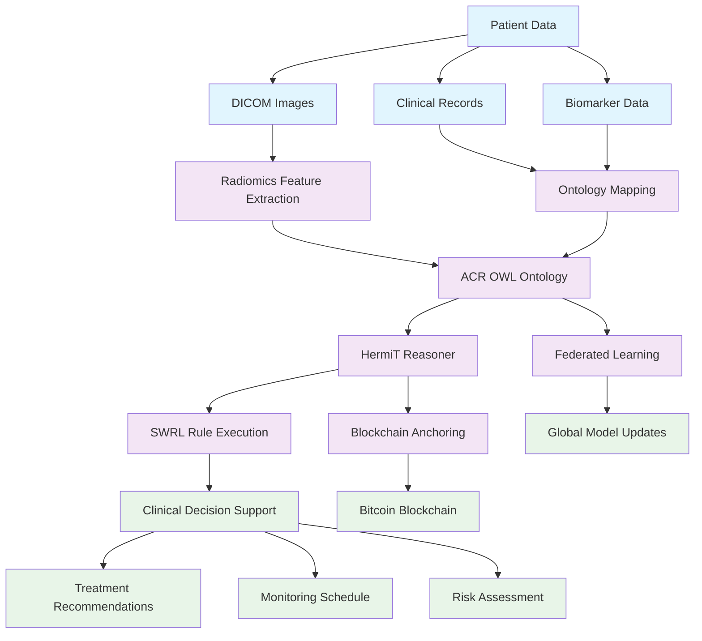
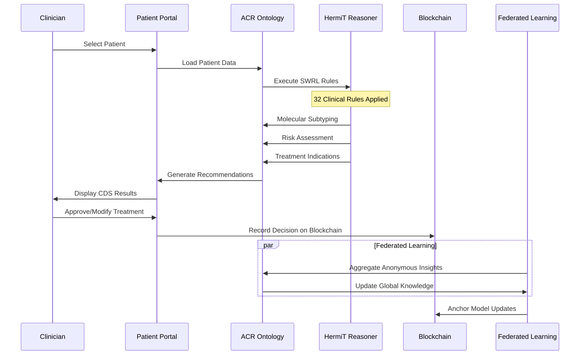
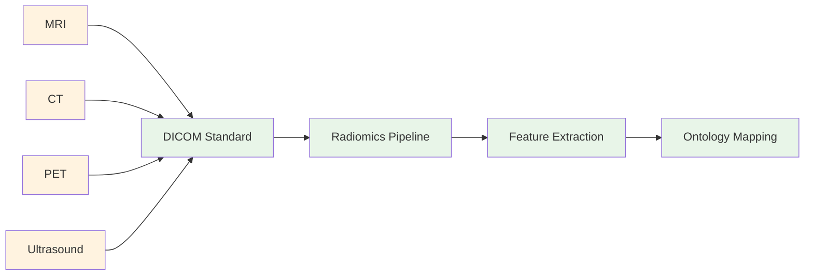
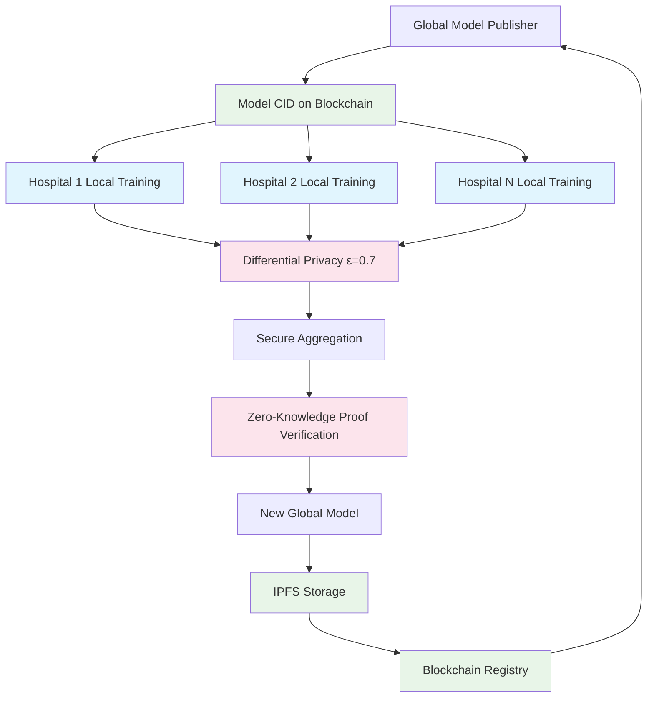

# ACR Platform v1.0
<!-- Phase II v2.1.2 -->

**AI-Powered Breast Cancer Clinical Decision Support Platform**

A comprehensive, ontology-driven clinical decision support system for breast cancer diagnosis and treatment, combining semantic reasoning, agentic AI, blockchain security, and federated learning.

## Overview

The ACR Platform integrates:
- **Ontology-Based Reasoning**: ACR OWL ontology with SWRL/SQWRL rules and HermiT 1.4.3.456 reasoner
- **Clinical Decision Support**: Real-time treatment recommendations based on CACA/CSCO/NCCN guidelines
- **DICOM Integration**: Medical imaging support with advanced radiomics
- **Agentic AI**: Intelligent agents for continuous ontology refinement and learning
- **Blockchain Security**: RSK-based MCP server with Bitcoin blockchain anchoring
- **Federated Learning**: Privacy-preserving model training across institutions

## Live Platform

🌐 **Production Website**: [www.acragent.com](https://www.acragent.com)

## Architecture



## Core Features

### Clinical Decision Support
- **Real-time SWRL Rule Execution**: 32 clinical rules for treatment recommendations
- **Molecular Subtyping**: Luminal A/B, HER2-enriched, Triple Negative classification
- **Risk Stratification**: Low/Intermediate/High risk assessment
- **Guideline Integration**: CACA, CSCO, NCCN, and international standards
- **Treatment Timeline**: Visual treatment pathway with monitoring schedule

### DICOM & Medical Imaging
- **DICOM Standard Support**: Full compliance with medical imaging standards
- **Radiomics Feature Extraction**: Texture, shape, and intensity analysis
- **Multi-modal Imaging**: MRI, CT, PET, and ultrasound integration
- **Automated Segmentation**: AI-powered tumor region identification
- **Quantitative Analysis**: Hundreds of radiomic features extraction

### Ontology-Driven Reasoning
- **ACR OWL Ontology**: Comprehensive breast cancer knowledge base
- **HermiT Reasoner**: Logical inference and consistency checking
- **SWRL Rules**: Clinical decision logic automation
- **SQWRL Queries**: Data retrieval and analysis
- **Entity Mapping**: Patient data to ontology classes

### Privacy & Security
- **Blockchain Anchoring**: Bitcoin blockchain for data integrity
- **RSK MCP Server**: Secure smart contract execution
- **Federated Learning**: Local model training, global knowledge sharing
- **Data Protection**: No raw patient data leaves hospital premises

## Clinical Workflow



## Quick Start

### Access Production System
1. Visit [www.acragent.com](https://www.acragent.com)
2. Select patient from dropdown or use direct patient links
3. Generate clinical recommendations in real-time
4. Review treatment pathways with confidence scoring

### Local Development
```bash
# Clone repository
git clone https://github.com/KY-BChain/ACR-platform.git
cd ACR-platform

# Start local services
docker-compose up -d

# Access CDS interface
open http://localhost:8080/acr-pathway.html
```

## DICOM Integration

### Supported Modalities


### Radiomics Features
- **First-Order Statistics**: Intensity-based features
- **Shape-based**: 3D tumor morphology
- **Texture Features**: GLCM, GLRLM, GLSZM
- **Wavelet Features**: Multi-scale analysis
- **Deep Learning**: CNN-based feature extraction

## Federated Learning Cycle



## Technology Stack

### Core Technologies
- **Ontology**: OWL 2, SWRL, SQWRL, HermiT 1.4.3.456
- **Frontend**: HTML5, CSS3, JavaScript (ES6+)
- **Backend**: PHP, Node.js, REST APIs
- **Database**: MySQL/PostgreSQL with ontology mapping

### Medical Imaging
- **DICOM**: Full standard compliance
- **Radiomics**: PyRadiomics, MONAI
- **Visualization**: Cornerstone.js, OHIF Viewer
- **Processing**: ITK, SimpleITK, NumPy

### AI & Machine Learning
- **Reasoning**: HermiT reasoner, SWRL rule engine
- **Agents**: Agentive AI for ontology refinement
- **Federated Learning**: MONAI, PyTorch, Differential Privacy
- **Computer Vision**: CNN, Vision Transformers

### Blockchain & Security
- **Blockchain**: Bitcoin (via RSK), MCP Server
- **Identity**: ERC-3643 compliant management
- **Privacy**: Zero-knowledge proofs, homomorphic encryption

## Clinical Integration

### Supported Guidelines
- **CACA**: Chinese Anti-cancer Association Breast Cancer Guidelines
- **CSCO**: Chinese Society of Clinical Oncology
- **NCCN**: National Comprehensive Cancer Network
- **International Standards**: EU and USA best practices

### Biomarker Support
- ER/PR status and percentage
- HER2 IHC and ISH results
- Ki-67 proliferation index
- Histologic grade and tumor characteristics
- DICOM-based radiomic features

## API Endpoints

```javascript
// Patient Data
GET /api/patients.php              # List all patients
GET /api/patients.php?id={id}      # Get specific patient

// Clinical Recommendations
POST /api/recommendations.php      # Generate CDS recommendations

// DICOM Services
POST /api/dicom/upload            # Upload DICOM images
GET /api/dicom/features/{id}      # Extract radiomic features
POST /api/dicom/analyze           # AI-based image analysis
```

## Development Status

### ✅ Production Ready
- Clinical Decision Support System
- Ontology-driven reasoning
- Real-time treatment recommendations
- Multi-guideline compliance
- Blockchain security layer
- DICOM image support

### 🔄 Active Development
- Advanced radiomics integration
- Federated learning deployment
- Agentic AI refinement
- Expanded cancer types
- Enhanced visualization

## Compliance & Standards

- **Medical Standards**: CACA, CSCO, NCCN compliant
- **Imaging Standards**: DICOM, HL7, FHIR
- **Data Privacy**: GDPR, PIPL, HIPAA ready
- **Security**: Blockchain-anchored audit trail
- **Clinical Validation**: Continuous guideline updates

## Documentation

- [Clinical Workflow](docs/clinical-workflow.md)
- [Ontology Guide](docs/ontology-guide.md)
- [DICOM Integration](docs/dicom-integration.md)
- [API Documentation](docs/api/)
- [Deployment Guide](docs/deployment/)

## Contributing

We welcome contributions from clinicians, researchers, and developers. Please see [CONTRIBUTING.md](CONTRIBUTING.md) for details.

## Citation

If you use ACR Platform in your research, please cite:
```
ACR Platform: AI-Powered Breast Cancer Clinical Decision Support System
Version 1.0, 2024 - www.acragent.com
```

## License

This project is licensed under the MIT License - see the [LICENSE](LICENSE) file for details.

## Contact

- **Production Site**: [www.acragent.com](https://www.acragent.com)
- **Clinical Support**: clinical@acragent.com
- **Technical Support**: tech@acragent.com
- **Research Collaboration**: research@acragent.com

## Acknowledgments

- **CACA**: Chinese Anti-cancer Association for clinical guidelines
- **CSCO**: Chinese Society of Clinical Oncology for treatment standards
- **NCCN**: National Comprehensive Cancer Network for international protocols
- **RSK**: Blockchain infrastructure and MCP server
- **HermiT**: Ontology reasoner development team
- **DICOM Standards Committee**: Medical imaging standards

---

**Version**: 1.0  
**Last Updated**: 25-November 2024  
**Status**: Production  
**Clinical Focus**: Breast Cancer Diagnostics & Treatment  
**Live Platform**: [www.acragent.com](https://www.acragent.com)  
**DICOM Support**: Full compliance with medical imaging standards


