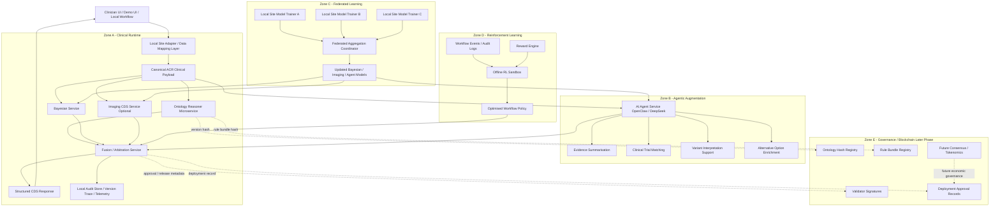
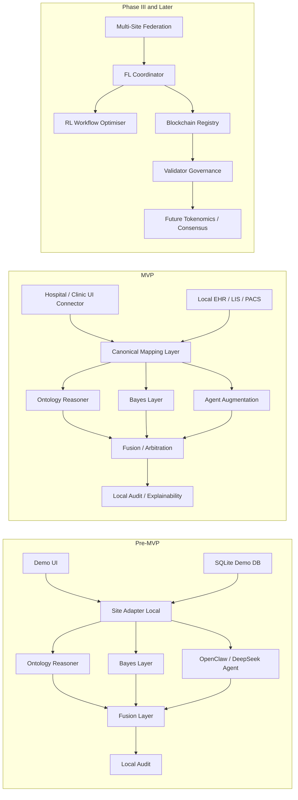

# ACR Platform v2.1.2 — Full System Design Principles, Architecture, and Technical Stack
**Date:** 7 April 2026
**Author:** Kraken YU  
**Purpose:** Integrate OpenClaw AI Skills with ACR Ontology Reasoner for Enhanced CDS  
**Purpose:** Pre-MVP local-development and implementation architecture for ACR Platform  
**Context:** Breast cancer domain first, ontology-reasoner microservice validated at v2.1, Bayes layer optional with default ON, OpenClaw/DeepSeek agentic layer for augmentation, local demo/test DB retained for development, MVP later connects to real local hospital/clinic/doctor data under the principle **Data Stays. Rules Move.**

## 1. Executive position

ACR Platform v2.1.2 should be defined as a **distributed, workflow-native, privacy-preserving clinical decision support platform** built around a **domain-agnostic ontology reasoner microservice**.

It is **not** a central data aggregation SaaS.  
It is **not** a single-model black-box AI system.  
It is **not** a blockchain-first application.

It is a **hybrid clinical intelligence platform** with clearly separated layers:

1. **Deterministic symbolic reasoning** — OWL ontology + SWRL + SQWRL via Openllet  
2. **Probabilistic reasoning** — Bayes' Theorem layer, optional, default ON  
3. **AI augmentation / agent layer** — OpenClaw skills with **DeepSeek as primary LLM backend**  
4. **Clinical fusion / arbitration layer** — combines outputs safely without letting learned systems silently override ontology-guided recommendations  
5. **Learning and governance layers** — federated learning, reinforcement learning, registry, blockchain governance outside the critical real-time CDS path

## 2. Core design principles

### 2.1 Data Stays. Rules Move.
- Real patient data remains with the local hospital, clinic, laboratory, PACS, LIS, or doctor.
- The ontology bundle, rule bundle, Bayes module, and augmentation services are deployed to where data already lives.
- Cross-site exchange is limited to policy-permitted, privacy-controlled metadata, model deltas, hashes, and governance artefacts.

### 2.2 Deterministic CDS first
The validated ontology reasoner is the primary clinical decision path.

- Ontology output is authoritative baseline CDS
- Bayes adds uncertainty/confidence
- OpenClaw/DeepSeek adds augmentation
- No augmentation layer should silently override guideline-based symbolic reasoning

### 2.3 Domain-agnostic core, domain-specific knowledge packs
The reasoner service should be generic.

First domain package:
- Breast cancer ontology
- 58 SWRL rules
- 27 SQWRL queries

Later domains:
- Lung cancer
- Cervical cancer
- Other oncology or clinical pathways

### 2.4 Separation of concerns
Each major function should be isolated:
- reasoning
- Bayesian scoring
- imaging/radiology
- agentic augmentation
- fusion/arbitration
- local integration
- audit
- federation
- governance

### 2.5 Explainability over opacity
Every CDS response must support:
- matched rule IDs
- ontology version
- rule bundle version
- guidance source family
- contraindication flags
- deviation flags
- manual review requirement
- local audit trace

### 2.6 Safety before automation
For pre-MVP and MVP:
- ontology may recommend
- Bayes may score
- OpenClaw may augment
- fusion may rank and flag
- clinician / MDT remains responsible for treatment choice

### 2.7 Blockchain is governance infrastructure, not runtime inference
No patient record, no raw inference payload, and no real-time clinical decision loop should depend on blockchain execution.

## 3. Operating scope of v2.1.2

### 3.1 Pre-MVP scope
This version is for:
- local development
- local integration
- demo workflows
- unit/integration testing
- demo/test DB operation
- validation against synthetic or controlled datasets

The current demo/test DB remains useful for:
- interface integration
- endpoint testing
- UI flow testing
- rule regression testing

### 3.2 MVP scope
The MVP adds:
- secure connector module to local hospital/clinic/doctor systems
- mapping from real-world local patient record structures to ACR canonical input schema
- site-local deployment profile
- stronger audit/export capability
- clinician-facing workflow integration

## 4. Full architecture overview

### Layer 0 — Local Data Foundation
**Purpose:** host all local patient and clinical context data inside the site boundary

**Pre-MVP implementation**
- SQLite demo/test DB with ~200 records for development/demo/testing
- local JSON fixtures
- local DICOM/file references where needed

**MVP/production direction**
- PostgreSQL at site
- local connectors to:
  - EHR
  - LIS
  - PACS
  - pathology systems
  - FHIR/HL7 sources

**Key principle**
- ACR does not “acquire” external patient data centrally
- local data is mapped in place into the ACR canonical reasoning payload

### Layer 1 — AI Agent Augmentation Layer
**Primary backend:** DeepSeek  
**Agent framework:** OpenClaw  
**Purpose:** augmentation, not primary authority

**Correction for v2.1.2**
This layer should reference **DeepSeek**, not Claude Sonnet, as the primary LLM backend.

**Recommended responsibilities**
- molecular profiling augmentation
- treatment option enrichment
- evidence summarisation
- prognosis commentary
- clinical trial matching
- variant interpretation support
- literature-grounded explanation support

**Not recommended for MVP authority**
- final treatment arbitration
- direct dose setting
- direct override of ontology contraindications
- unsupervised therapy escalation

**Preferred service design**
- Python FastAPI service
- OpenClaw skill runner
- provider abstraction for LLM backend

**Provider abstraction**
```yaml
llm_provider:
  primary: deepseek
  fallback: openai-compatible
  local_optional: future
```

### Layer 2 — Deterministic Clinical Reasoning Layer
**Core engine:** Openllet  
**Form:** OWL ontology + embedded SWRL + SQWRL  
**Service style:** Spring Boot microservice

This is the primary CDS engine.

**Inputs**
- mapped biomarker data
- stage/TNM
- pathology status
- imaging abstractions
- demographics
- treatment history
- optional genomics flags

**Outputs**
- molecular subtype
- treatment recommendations
- contraindication/safety alerts
- MDT triggers
- guideline deviation flags
- evidence/explanation trace

**Current validated breast cancer package**
- 58 SWRL rules
- 27 SQWRL queries
- embedded runtime rules
- consistent OWL structure

**Key architectural rule**
The reasoner service must remain **domain-agnostic** while loading domain-specific ontology bundles.

### Layer 3 — Bayesian Reasoning Layer
**Purpose:** probabilistic support and uncertainty handling  
**Default:** ON  
**Authority level:** advisory, not primary

**Recommended responsibilities**
- posterior risk scoring
- subtype confidence
- uncertainty bounds
- probability of pCR / recurrence / survival proxies where validated
- decision support ranking

**Inputs**
- reasoner outputs
- biomarkers
- age/context priors
- imaging or pathology probabilities where available

**Outputs**
- confidence scores
- posterior distributions
- uncertainty indicators
- optional ranking/triage metadata

**Recommended stack**
- Python
- FastAPI
- NumPy / SciPy / pandas
- model configuration in JSON/YAML

### Layer 4 — Clinical Fusion / Arbitration Layer
Replace “consensus engine weighted voting” with a **clinical fusion/arbitration engine**.

**Why**
A validated deterministic ontology reasoner should not simply be one vote among three.  
The ontology path is the primary guideline-governed source.

**Recommended decision policy**
1. Ontology result forms baseline CDS recommendation
2. Bayes adds confidence and uncertainty
3. OpenClaw/DeepSeek adds alternative options, summaries, and augmentative insights
4. If Bayes or OpenClaw conflict with ontology:
   - flag conflict
   - require clinician review or MDT review
5. Final treatment escalation should not be caused by augmentation alone

**Recommended outputs**
- final recommendation set
- confidence score
- conflict list
- requires_manual_review
- requires_mdt
- rationale blocks by source

**Authority hierarchy**
Ontology > Fusion governance > Bayes/OpenClaw augmentation

### Layer 5 — Federated Learning Layer
**Purpose:** privacy-preserving cross-site improvement for learned modules  
**Not on the critical live CDS path**

**Applies to**
- Bayesian priors tuning
- imaging models
- triage/ranking models
- OpenClaw skill refinement
- non-deterministic workflow optimisation

**Does not apply to**
- automatic mutation of ontology logic
- automatic rewriting of validated SWRL rules

**Recommended stack**
- Python
- PySyft and/or Flower
- secure aggregation
- differential privacy support
- site-level policy controls

### Layer 6 — Reinforcement Learning Layer
**Purpose:** later-stage optimisation  
**Pre-MVP/MVP authority:** restricted

**Recommended MVP-safe use**
- workflow optimisation
- case routing
- reminder timing
- queue prioritisation
- MDT scheduling optimisation

**Not recommended initially**
- autonomous treatment selection
- autonomous dose control
- autonomous clinical override decisions

**Recommended stack**
- Python
- Stable-Baselines3
- offline/sandbox training first

### Layer 7 — Blockchain Governance / Consensus Layer
**Purpose:** governance, registry, versioning, audit anchoring, later tokenised consensus  
**Not in the real-time clinical path**

**Suitable blockchain uses**
- ontology version hashes
- rule bundle hashes
- release manifest hashes
- deployment approvals
- validator signatures
- node registry
- licensing records
- governance proposals

**Not suitable in live CDS runtime**
- real-time patient decision execution
- raw patient data
- raw clinical records
- heavy operational logs

## 5. Target deployment zones

### Zone A — Clinical runtime (must work for MVP)
- local data adapter
- ontology reasoner service
- Bayesian service
- fusion/arbitration service
- audit store
- clinician-facing UI connector

### Zone B — Clinical augmentation
- OpenClaw/DeepSeek augmentation
- trial matching
- prognosis commentary
- evidence summarisation

### Zone C — Learning and governance
- federated learning
- reinforcement learning
- blockchain governance
- token-driven consensus (future phase)

## 6. Canonical service decomposition

### Service 1 — `acr-reasoner-service`
**Stack**
- Java 21 LTS recommended
- Spring Boot 3.x
- Openllet
- OWLAPI-compatible libraries
- Maven or Gradle
- Docker

**Responsibilities**
- load ontology bundle
- run SWRL
- run SQWRL
- infer subtype and recommendations
- return explainability and provenance

**Endpoints**
- `POST /api/v1/reasoner/infer`
- `POST /api/v1/reasoner/explain`
- `POST /api/v1/reasoner/validate-payload`
- `GET /api/v1/reasoner/health`
- `GET /api/v1/reasoner/version`

### Service 2 — `acr-bayes-service`
**Stack**
- Python 3.11+
- FastAPI
- Uvicorn/Gunicorn
- NumPy
- SciPy
- pandas
- Pydantic
- Docker

### Service 3 — `acr-openclaw-agent-service`
**Primary LLM backend:** DeepSeek  
**Stack**
- Python 3.11+
- FastAPI
- OpenClaw runtime
- provider abstraction wrapper
- Docker

### Service 4 — `acr-fusion-service`
**Stack**
- Spring Boot or Python FastAPI
- policy engine
- rules-based arbitration layer
- Docker

### Service 5 — `acr-site-adapter-service`
**Stack**
- Spring Boot
- HAPI FHIR
- HL7 integration libraries
- DICOM/PACS connectors as needed
- Docker

### Service 6 — `acr-audit-service`
**Stack**
- Spring Boot or Python
- PostgreSQL
- Docker

### Service 7 — `acr-imaging-cds-service`
**Stack**
- Python
- FastAPI
- OpenCV / MONAI / imaging stack as needed
- Docker

## 7. Canonical data and response model

### 7.1 Canonical internal reasoning payload
```json
{
  "patient_id": "local-site-id",
  "age": 52,
  "sex": "female",
  "er_status": "positive",
  "pr_status": "positive",
  "her2_status": "negative",
  "ki67": 28,
  "pdl1_status": "positive",
  "tnm_stage": "T2N1M0",
  "histologic_grade": 3,
  "birads": 5,
  "lvef": 58,
  "pregnancy_status": "not_pregnant",
  "family_history": true,
  "brca_status": "unknown"
}
```

### 7.2 Canonical fusion response
```json
{
  "request_id": "uuid",
  "site_id": "site-code",
  "ontology_version": "ACR_Ontology_Full_v2_1",
  "rule_bundle_version": "58-rule-bundle",
  "reasoner_result": {
    "molecular_subtype": "LuminalB_HER2neg",
    "recommendations": [],
    "alerts": [],
    "guideline_deviations": [],
    "matched_rule_ids": [],
    "requires_mdt": false
  },
  "bayesian_result": {
    "enabled": true,
    "confidence": 0.91,
    "risk_scores": {},
    "uncertainty": {},
    "notes": []
  },
  "agent_result": {
    "enabled": true,
    "provider": "deepseek",
    "skills_used": [],
    "alternative_options": [],
    "trial_matches": [],
    "notes": []
  },
  "fusion_result": {
    "final_recommendations": [],
    "conflicts": [],
    "requires_manual_review": false,
    "requires_mdt": false,
    "authority_source": "ontology_primary"
  },
  "audit": {
    "timestamp": "ISO-8601",
    "site_local_only": true
  }
}
```

## 8. Technical stack summary

### Core platform
- GitHub repository / GitHub Desktop / VS Code
- Docker / Docker Compose
- local macOS development
- Java 21 LTS recommended
- Python 3.11+
- PostgreSQL for site-local persistent operational storage
- SQLite retained for demo/testing during pre-MVP
- OpenAPI/Swagger for service contracts

### Symbolic reasoning
- Openllet
- OWL ontology bundles
- SWRL / SQWRL
- OWLAPI ecosystem
- Protégé for ontology editing/review

### Bayesian layer
- NumPy
- SciPy
- pandas
- FastAPI
- Pydantic

### Agentic augmentation
- OpenClaw
- DeepSeek primary backend
- optional provider abstraction for other backends

### Imaging
- OpenCV
- MONAI or equivalent later if needed
- DICOM integration adapters

### Site integration
- Spring Boot
- HAPI FHIR
- HL7 adapters
- local mapping configs per hospital/site

### Federation
- PySyft and/or Flower
- secure aggregation
- differential privacy

### Reinforcement learning
- Stable-Baselines3
- offline/sandbox training setup

### Governance / blockchain
- Solidity
- Rootstock/RSK-compatible governance layer
- off-chain manifests and signed release artefacts

## 9. Suggested repo/module structure for v2.1.2

```text
ACR-platform/
├── services/
│   ├── acr-reasoner-service/
│   ├── acr-bayes-service/
│   ├── acr-openclaw-agent-service/
│   ├── acr-fusion-service/
│   ├── acr-site-adapter-service/
│   ├── acr-audit-service/
│   └── acr-imaging-cds-service/
├── ontology/
│   ├── breast-cancer/
│   ├── shared/
│   └── validation/
├── data/
│   ├── sqlite-demo/
│   ├── fixtures/
│   └── mapping-schemas/
├── federation/
│   ├── coordinator/
│   ├── privacy/
│   └── policies/
├── rl/
│   ├── workflow-optimizer/
│   └── sandbox/
├── blockchain/
│   ├── contracts/
│   ├── manifests/
│   └── governance/
├── deployment/
│   ├── docker/
│   ├── compose/
│   └── site-profiles/
└── docs/
    ├── architecture/
    ├── api/
    ├── validation/
    └── governance/
```

## 10. Delivery roadmap for v2.1.2

### Phase A — Pre-MVP hardening
1. Freeze validated ontology bundle
2. Build `acr-reasoner-service`
3. Build `acr-bayes-service`
4. Build `acr-fusion-service`
5. Keep SQLite demo DB operational
6. Connect existing demo frontend through adapter layer

### Phase B — Augmentation layer
1. Build OpenClaw service with DeepSeek backend
2. Limit it to augmentation functions
3. Add provider abstraction
4. Add audit capture of agent outputs

### Phase C — MVP connector layer
1. Build site-adapter service
2. Map local real-world patient structures to canonical schema
3. Add PostgreSQL local site profile
4. Add clinician workflow integration

### Phase D — Later-phase intelligence and governance
1. Federated learning for learned modules
2. RL for workflow optimisation
3. blockchain registry and governance
4. tokenised consensus / Phase III features

## 11. Final architectural decisions for v2.1.2

1. **DeepSeek replaces Claude as the primary LLM backend in the AI agent layer**
2. **Openllet ontology reasoner microservice is the primary CDS authority**
3. **Bayes layer is optional, default ON, advisory**
4. **OpenClaw agent layer is augmentative, not primary authority**
5. **Weighted voting is replaced by clinical fusion/arbitration policy**
6. **Real patient data remains at local institution**
7. **MVP adds connector/UI layer to local real-world systems**
8. **Reasoner service remains domain-agnostic; breast cancer is the first validated package**
9. **SQLite demo/test DB continues for development and demonstration**
10. **Federated learning, RL, and blockchain governance remain outside the critical real-time inference path**
11. **Consensus/governance token belongs to a later phase, not pre-MVP authority**
12. **Every response must remain explainable, versioned, and auditable**

## 12. Final conclusion

ACR Platform v2.1.2 should be delivered as a **modular, distributed, site-local clinical decision support platform** in which:

- **data stays local**
- **rules move to the data**
- **ontology reasoning is primary**
- **Bayesian scoring is optional but default ON**
- **OpenClaw + DeepSeek augments rather than overrides**
- **fusion/arbitration enforces safety and explainability**
- **federated learning, RL, and blockchain governance are layered in progressively after the core CDS runtime is stable**

## 13. FlowChat

## Detailed Mermaid architecture chart


## Simpler phase-by-phase Mermaid chart



## Three-layer learning view, reflects the correct separation:
Layer 1 = symbolic truth/governed baseline
Layer 2 = probabilistic and augmentation intelligence
Layer 3 = optimisation and later governance

```mermaid
flowchart TD

    A[Layer 1 - Deterministic Reasoning]
    A1[OWL Ontology]
    A2[SWRL Rules]
    A3[SQWRL Queries]
    A --> A1
    A --> A2
    A --> A3

    B[Layer 2 - Probabilistic / Learned Models]
    B1[Bayesian Scoring]
    B2[Imaging Models]
    B3[Agent Augmentation Models]
    B --> B1
    B --> B2
    B --> B3

    C[Layer 3 - Optimisation / Governance]
    C1[Federated Learning]
    C2[Reinforcement Learning]
    C3[Release Governance]
    C4[Future Blockchain Consensus]
    C --> C1
    C --> C2
    C --> C3
    C --> C4

    A --> D[Fusion / Arbitration Engine]
    B --> D
    C2 --> D

    D --> E[Final Explainable CDS Output]
    ```