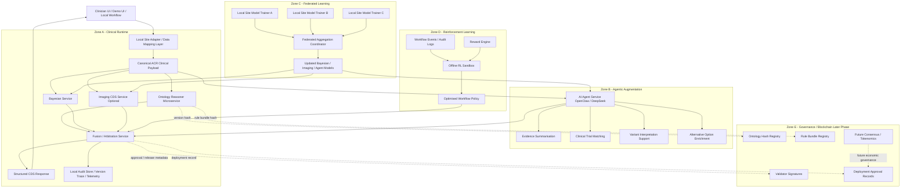
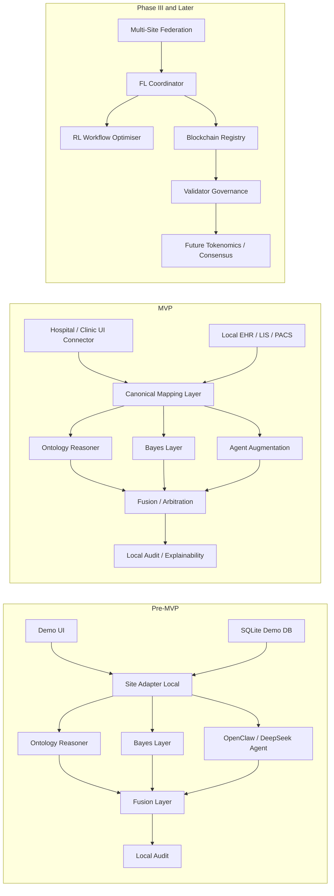
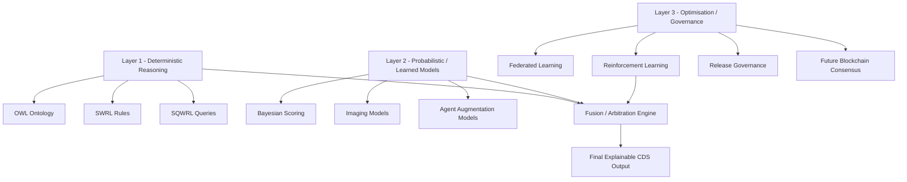

Overall: this is a **strong v2.1.1 architecture**, and the direction is right. The best parts are the clear separation of symbolic reasoning, probabilistic scoring, learning layers, and governance; the insistence that data stays inside the hospital node; and the move to an ontology reasoner microservice with a validated 58-rule bundle.  

My main recommendation is not to change the overall vision, but to **tighten the operating boundaries** between layers. Right now, the document is ambitious and coherent, but a few parts are still too optimistic for an MVP and a few control loops need stricter safety design. 

## What is strong already

Your architecture now has a sensible hierarchy:

* hospital-local data foundation;
* symbolic CDS via Openllet;
* Bayesian confidence layer;
* AI skill augmentation layer;
* later federated learning and reinforcement learning;
* governance outside the critical inference path. 

That is much better than trying to make one monolithic “AI brain”. The reasoner remains explainable and deterministic, while the other layers can add probabilistic or exploratory value. That is the right shape for a clinical system.

## My most important suggested changes

### 1. Replace “consensus engine” with a “clinical fusion and arbitration engine”

This is the single biggest design change I would make.

Your current weighted voting idea:

* SWRL 40%
* Bayesian 30%
* OpenClaw 30%

is elegant as software, but weak as clinical governance. A deterministic rule engine based on validated guideline logic should not merely be one vote among three. In a CDS system, the ontology path should normally be the **authoritative baseline**, and the Bayes/OpenClaw paths should be **advisory or escalation-generating**, not co-equal voters.

A better rule is:

* **Ontology reasoner**: primary recommendation source
* **Bayesian layer**: confidence, uncertainty, prioritisation
* **OpenClaw layer**: augmentation only
* **Fusion engine**: resolve, annotate, escalate, never silently override ontology on treatment

So instead of “weighted voting”, use something closer to:

* if ontology and Bayes agree, confidence increases;
* if OpenClaw suggests an alternative, present as alternative;
* if there is conflict, require clinician/MDT review;
* treatment escalation should never be caused solely by OpenClaw.

### 2. Keep OpenClaw out of the core treatment-decision authority path for MVP

This is the second major point.

OpenClaw skills are modular and flexible, but they are also a fast-moving agent/tool ecosystem with security and operational concerns. Recent reporting also indicates a major usage-policy shift around Claude and OpenClaw integrations, meaning subscription-based access assumptions are unstable and API-key-based operation is now the safer assumption. ([TechRadar][1])

So for MVP, I would scope OpenClaw to:

* clinical trial matching
* literature/evidence summarisation
* variant interpretation assistance
* prognosis commentary
* non-binding alternative options

I would **not** let it directly set final treatment recommendations in the MVP arbitration layer. That can come later, after local validation.

### 3. Reinforcement learning should not recommend treatment actions in the first MVP

Your RL layer currently includes treatment selection, dosing, follow-up scheduling, and MDT referral in its action space. That is too aggressive for MVP. 

For the first implementation, RL is better restricted to:

* workflow optimisation
* triage ordering
* MDT queue prioritisation
* reminder timing
* non-clinical operational routing

Why: RL is the least explainable part of your stack, and it also depends on high-quality outcome data over time. It is much safer to first use RL to improve process efficiency rather than core treatment decisions. 

### 4. Federated learning stack choice needs a second look

PySyft is still useful, but it has evolved into a broader privacy-preserving data and remote-computation framework rather than a simple classic FL training library. That means it may be heavier and more governance-oriented than you need for an early MVP. ([MDPI][2])

For MVP, you may want to compare PySyft against simpler FL stacks depending on what you actually need first:

* if you want strict data-owner governance and remote execution, PySyft can make sense;
* if you mainly want model aggregation across sites, a lighter FL stack may reduce complexity.

So I would keep the **federated learning concept**, but mark the exact FL library as **implementation-open**, not final.

### 5. Blockchain governance is sensible, but the current form is too early for MVP runtime

Your architecture already keeps blockchain out of the live CDS path, which is correct. 

The part I would tone down is the breadth of on-chain governance in the MVP. The Rootstock MCP server is real and intended to give AI clients on-chain tools for Rootstock interactions, but that does not automatically make it the right production governance backbone for a regulated clinical platform. ([MCPHub][3])

For MVP, I would narrow blockchain usage to:

* ontology/rule bundle hash registry
* release manifest and signatures
* deployment approval record
* partner/node registry

I would postpone until later:

* weighted democratic voting on model changes
* automatic agent updates after on-chain approval
* weekly governance-driven model deployment

That later governance layer may be valuable, but it is not necessary to prove CDS value in MVP.

### 6. DeepSeek should be treated as an optional provider, not a core dependency

You mention DeepSeek in your prompt, though the attached architecture is mainly framed around OpenClaw + Claude. DeepSeek’s API is currently OpenAI-compatible and offers `deepseek-chat` and `deepseek-reasoner`, which makes it attractive as a model-provider option. ([DeepSeek API Docs][4])

My advice: architect this as a **provider abstraction**, not a hard dependency.

Use a provider interface like:

* `llm_provider = anthropic | deepseek | openai | local_model`

That way the OpenClaw/agent layer can switch backends without changing the CDS architecture.

## What I would change in the document structure

I would reframe the six layers into three operational zones.

### Zone A — Clinical runtime

This is what must work every day in a hospital:

* Local database / adapters
* Openllet reasoner
* Bayesian service
* Fusion/arbitration service
* Audit trail
* Clinician UI

### Zone B — Clinical augmentation

Helpful, but not required for safe baseline operation:

* OpenClaw skills
* Clinical trial matching
* Variant interpretation
* Prognosis assistance

### Zone C — Learning and governance

Not on the immediate critical path:

* Federated learning
* RL workflow optimisation
* Blockchain governance
* Model registry

This zoning makes the MVP much easier to defend to partners and investors.

## Specific technical suggestions

Your endpoints are generally sensible. I would add these:

* `POST /api/v1/fusion/recommend`
* `POST /api/v1/fusion/explain`
* `POST /api/v1/fusion/override-check`
* `GET /api/v1/audit/version-manifest`

And for the reasoner service, return explicit provenance:

* ontology version
* rule bundle version
* matched rule IDs
* guideline family
* contraindication flags
* “manual review required” boolean

That fits the validated ontology path you now have.

## What I would keep exactly as-is

I would keep these decisions:

* ontology as a microservice
* Bayesian layer separate from ontology
* hospital-local data storage
* Dockerised service decomposition
* hard-coded JS fallback only as fallback/demo
* no patient data on chain
* separate directory/module layout by service domain 

## My practical alternative architecture for MVP

If I were simplifying this for fastest safe delivery, I would make the MVP stack:

1. **Openllet reasoner service**
2. **Bayesian scoring service**
3. **Fusion/arbitration service**
4. **PostgreSQL + audit store**
5. **Existing demo frontend with adapter layer**
6. **OpenClaw limited to trial matching / evidence augmentation only**

Then later phases:

* federated learning
* RL for workflow optimisation
* blockchain registry/governance
* richer agent ecosystem

That would reduce delivery risk while preserving your long-term architecture.

## Bottom line

My judgement is:

* **Architecture quality:** strong
* **Conceptual direction:** correct
* **Biggest improvement needed:** replace weighted “consensus” with a stricter **clinical arbitration / fusion policy**
* **Biggest MVP risk:** giving OpenClaw and RL too much authority too early
* **Best simplification:** keep ontology primary, Bayes advisory, OpenClaw augmentative, governance outside the live path

This design is now credible. It just needs a slightly harder safety boundary between deterministic CDS and the learned/agentic layers.

key changes:

* **DeepSeek** replaces Claude as the primary LLM backend in the AI agent layer.
* The document is framed explicitly as **pre-MVP local development / implementation architecture**.
* The ontology-reasoner microservice is treated as **domain-agnostic**, with breast cancer as the first validated domain package.
* Bayes remains **optional, default ON**.
* The old weighted “consensus engine” is replaced by a **clinical fusion / arbitration layer**.
* The later **blockchain-based ACR Consensus Engine / governance token** is positioned as a future phase, not pre-MVP authority.
* The existing SQLite demo/test DB remains part of the design for implementation, demo, and unit/integration testing.

I also aligned it with your earlier architecture documents and your validated ontology status. The result is a cleaner path from pre-MVP local development to MVP site-local deployment under **“Data Stays. Rules Move.”**    

You can download it here:

[ACR Platform v2.1.2 full system design principles, architecture, and tech stack](sandbox:/mnt/data/ACR_Platform_v2_1_2_Full_System_Design_Principles_Architecture_and_Tech_Stack.md)


Short design judgement:

* the **core platform direction is now correct**;
* the most important safety improvement is the **fusion/arbitration layer** replacing weighted voting;
* the strongest architectural asset is the **domain-agnostic ontology-reasoner microservice**;
* the best way to build from here is to implement services in this order:

  1. `acr-reasoner-service`
  2. `acr-bayes-service`
  3. `acr-fusion-service`
  4. `acr-openclaw-agent-service`
  5. `acr-site-adapter-service`

That sequence gives you the shortest credible path from validated ontology to a usable pre-MVP backend.

**HOW** federated learning or reinforcement learning **CAN** be achieved in pre-MVP without blockchain.

It means something narrower:

* **blockchain-based consensus/governance** is **not required** for pre-MVP;
* **AI agents can still run locally or across a controlled private network**;
* **federated learning and RL can be tested before any blockchain layer exists**.

Those are separate concerns.

# The key separation

You really have **three different things** here:

## 1. AI agent execution

This is the agent actually doing work:

* calling the ontology reasoner
* calling Bayes service
* calling DeepSeek / OpenClaw skills
* orchestrating workflow
* generating summaries
* matching trials
* flagging conflicts

This can run:

* on one laptop
* on one hospital server
* inside Docker Compose
* inside a private LAN
* inside Kubernetes
* with no blockchain at all

## 2. Federated / reinforcement learning

This is about **improving models or policies over time**.

That can also run without blockchain.

### Federated learning can run with:

* central coordinator server
* secure aggregation server
* site-local training nodes
* encrypted model updates
* policy-controlled exchange

No blockchain is inherently required.

### Reinforcement learning can run with:

* local simulator
* offline replay buffer
* historical audit logs
* sandbox training environment

Again, no blockchain is inherently required.

## 3. Blockchain governance / consensus

This is about:

* who approves a new rule bundle
* who signs ontology version releases
* who is allowed to deploy a new model
* how multi-institution governance is recorded
* later, how tokenised governance might work

That is about **trust, approval, version control, and governance**, not about the basic ability of AI agents to function.

So the answer is:

**AI agents, federated learning, and reinforcement learning can all function in pre-MVP without blockchain.**

---

# How the AI Agent functions in pre-MVP

In pre-MVP, the AI agent should function as a **local orchestration and augmentation service**, not as a decentralised network consensus actor.

A good pre-MVP mental model is this:

```text
Demo UI / test DB
        ↓
Site adapter or local mapper
        ↓
Fusion service
   ↙      ↓       ↘
Ontology  Bayes   Agent service
reasoner  service OpenClaw/DeepSeek
```

The agent does not need blockchain to do this.

## Pre-MVP agent roles

At this stage, the AI agent can do things like:

* accept a patient/test payload
* call the ontology reasoner microservice
* call the Bayes service
* optionally call imaging service
* call DeepSeek/OpenClaw augmentation skills
* collect results
* send them to the fusion/arbitration service
* return a structured CDS response
* write audit metadata locally

That is already a real agentic workflow.

---

# What the agent should do in pre-MVP

For pre-MVP, the agent should be limited to these safe roles:

## 1. Orchestration

It routes requests between services:

* reasoner
* Bayes
* imaging
* audit
* UI

## 2. Augmentation

It provides:

* evidence summaries
* trial matching
* prognosis commentary
* alternative options
* literature support

## 3. Workflow support

It can:

* prepare MDT packets
* assemble explanation views
* generate structured notes
* flag missing data

## 4. Developer/testing support

It can:

* run fixture cases
* compare ontology vs Bayes outputs
* validate API payloads
* generate test reports

That is enough for strong pre-MVP value.

---

# What the agent should not do yet in pre-MVP

It should **not** yet be responsible for:

* autonomous clinical authority
* automatic treatment override
* on-chain consensus decisions
* unsupervised multi-node policy enforcement
* automated ontology mutation
* autonomous RL-based treatment action selection

Those belong to much later phases, if at all.

---

# What federated learning looks like in pre-MVP without blockchain

You can still prove FL conceptually in pre-MVP.

Example:

* Site A has local synthetic dataset
* Site B has another local synthetic dataset
* both train a Bayesian risk model locally
* they send only model updates to a coordinator
* coordinator aggregates updates
* updated model is redistributed

That is federated learning.

No blockchain needed.

In early proof mode, this can even be simulated on one machine using separate containers pretending to be separate institutions.

---

# What reinforcement learning looks like in pre-MVP without blockchain

You can also prove RL in pre-MVP without blockchain.

Example safe RL use cases:

* optimise case routing order
* optimise MDT scheduling priority
* optimise alert timing
* optimise which cases should be escalated first

How to do this:

* use synthetic cases
* use simulated workflow outcomes
* define reward functions such as:

  * lower turnaround time
  * fewer missed urgent cases
  * better queue efficiency

Again, no blockchain needed.

---

# So why keep blockchain later?

Because blockchain is useful for a different problem:

## It helps when you later need:

* cross-institution trust
* signed rule/version approvals
* auditable governance
* node membership registry
* controlled release workflow
* future tokenised consensus

That is valuable later.

But it is **not a prerequisite** for proving:

* ontology reasoning
* agent orchestration
* FL mechanics
* RL workflow optimisation

---

# Best pre-MVP architecture for the AI agent

For your current stage, I would define the AI agent like this:

## Pre-MVP AI Agent = local orchestration layer

### Inputs

* demo/test DB record
* mapped patient payload
* optional clinician prompt/request

### Actions

* invoke reasoner
* invoke Bayes
* invoke OpenClaw/DeepSeek skill
* collect outputs
* send to fusion service
* log audit metadata

### Outputs

* structured CDS packet
* explanation packet
* augmentation notes
* conflict flags
* trial/evidence suggestions

This can run entirely:

* locally
* in Docker
* with your demo UI
* without blockchain

---

# The right phased progression

## Pre-MVP

* local AI agent
* local services
* demo DB
* synthetic data
* no blockchain dependency

## MVP

* site-local hospital deployment
* local real patient connectors
* stronger audit and controls
* still no blockchain in critical path

## Phase III or later

* multi-site governance
* blockchain registry
* approval workflow
* optional consensus token
* federated coordination trust layer

That is the clean progression.

---

# The short answer

Your AI agent in pre-MVP should function as:

* a **local orchestration service**
* an **augmentation service**
* a **workflow support layer**
* a **test harness coordinator**

It does **not** need blockchain to do that.

Blockchain only becomes useful later when you want:

* multi-party trust,
* release governance,
* institutional consensus,
* and potentially tokenised governance.

So your pre-MVP can absolutely include:

* ontology microservice,
* Bayes layer,
* OpenClaw/DeepSeek agent layer,
* federated learning experiments,
* RL workflow experiments,

all **without** blockchain being active.

Yes — your understanding is **correct in substance**.

Blockchain deployment is mainly a question of:

* **governance**
* **tokenomics**
* **multi-party trust**
* **approval and registry**
* **economic coordination across institutions/nodes**

It is **not** the thing that makes an AI agent function.

And even for early **federated learning** and **reinforcement learning** experiments, you do **not** need blockchain first. You can do that with:

* one machine,
* one local network,
* one simulated node,
* or multiple containers pretending to be separate nodes.

What matters for FL and RL is:

* how training/workflow logic is organised,
* how updates are exchanged,
* how rewards are computed,
* how policies are improved,
* how privacy boundaries are enforced.

Not tokenomics.

The only refinement I would make to your statement is this:

* **federated learning** usually becomes meaningful when you simulate or use **more than one client/site**, because federation is about distributed local training plus aggregation;
* **reinforcement learning** can absolutely begin on **one node** using simulation, offline logs, or workflow sandboxes;
* **agentic orchestration** can begin on a single node with no blockchain at all.

So:

* one single node is enough to start **agentic orchestration**
* one single node is enough to start **RL proof-of-concept**
* one single node is enough to start **simulated FL framework testing**
* but true FL value appears when you have **at least two logical sites/clients**, even if they are simulated on one machine

---

# Recommended interpretation for ACR

## Pre-MVP

No blockchain required.

You can run:

* ontology reasoner
* Bayes layer
* OpenClaw/DeepSeek agent
* fusion layer
* local audit store
* simulated FL coordinator
* sandbox RL trainer

all locally.

## MVP

Still no blockchain required in the critical clinical path.

You can add:

* hospital/clinic connector layer
* real local site deployment
* multi-node private federation if needed
* model aggregation rules
* governance by conventional signed releases

## Later phase

Blockchain becomes useful for:

* ontology/rule release registry
* validator approvals
* commercial tokenomics
* partner/node governance
* consensus around upgrades
* incentive design across institutions

That is where tokenomics belongs.

---

# Detailed Mermaid architecture chart

Use this version first. It is detailed but still readable in Mermaid.



---

# Simpler phase-by-phase Mermaid chart

This one is better if you want to explain the roadmap to developers or investors.



---

# Three-layer learning view

Since you mentioned “federated and reinforcement learning in three layers”, this is the cleanest technical interpretation for ACR:



This reflects the correct separation:

* Layer 1 = symbolic truth/governed baseline
* Layer 2 = probabilistic and augmentation intelligence
* Layer 3 = optimisation and later governance

---

# Best practical conclusion

Blockchain deployment:

**Yes.** that blockchain deployment is mainly about **tokenomics/governance**, not the basic functioning of AI agents.

And also:

**Yes.**
In pre-MVP, even with a **single-node or simulated multi-node environment**, you can already test:

* AI agent orchestration
* Bayesian integration
* fusion/arbitration
* simulated federated learning
* RL workflow optimisation

without needing blockchain to be active.

The clean mental model is:

* **AI agents need services and orchestration**
* **FL needs distributed training logic**
* **RL needs reward loops and policy updates**
* **blockchain needs governance and economic reason to exist**

Those are related, but not the same thing.


[1]: https://www.techradar.com/pro/what-are-openclaw-skills-a-detailed-guide?utm_source=chatgpt.com "What are OpenClaw Skills? A detailed guide"
[2]: https://www.mdpi.com/2674-113X/4/4/28?utm_source=chatgpt.com "Software Engineering Aspects of Federated Learning Libraries: A Comparative Survey | MDPI"
[3]: https://mcphub.com/mcp-servers/rsksmart/rsk-mcp-server?utm_source=chatgpt.com "Rootstock MCP Server by rsksmart - MCP Server | MCPHub"
[4]: https://api-docs.deepseek.com/?utm_source=chatgpt.com "Your First API Call | DeepSeek API Docs"

